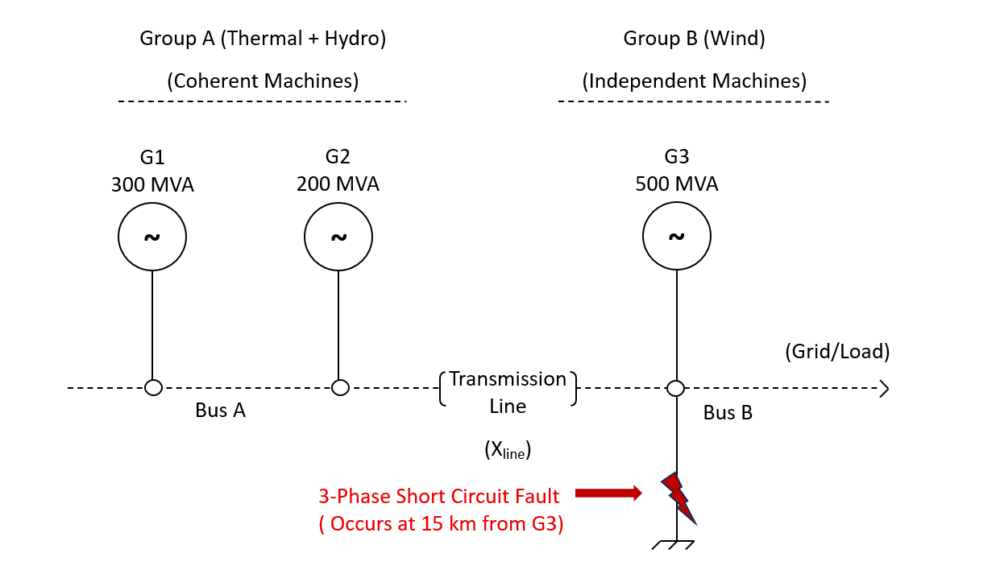
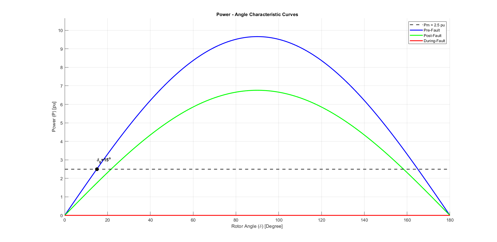
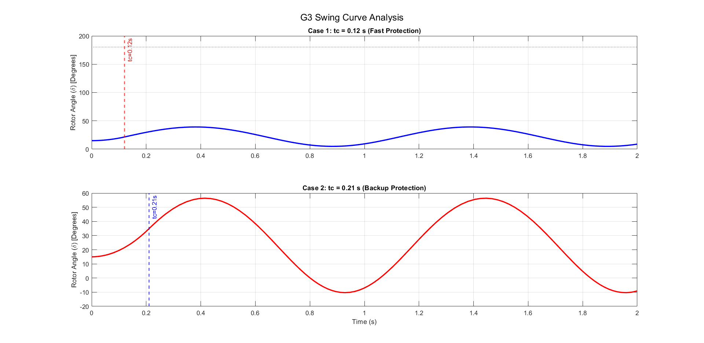
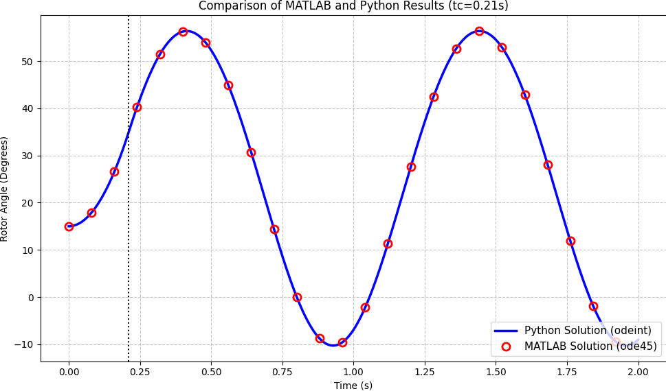
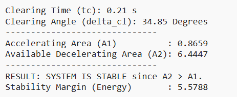
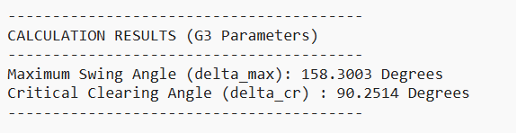
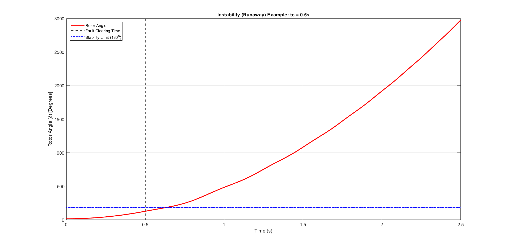

> 🇹🇷 **[Türkçe Versiyon İçin Tıklayınız / Click for Turkish Version](README_TR.md)**
 
---
# Analysis of Transient Stability in Multi Machine Power Systems Using Equal Area Criterion and Time Domain Simulations: Case Study of a Three Generator System 

    

---

This project investigates the transient stability of a multi-machine power system subjected to a three-phase short-circuit fault. The analysis employs the **Equal Area Criterion (EAC)** for theoretical calculation and validates the results using time-domain simulations in both **MATLAB (ODE45)** and **Python (SciPy)**.

## 🎓 Project Information

| Field | Details |
| :--- | :--- |
| **Topic** | Power System Stability & Protection Coordination |
| **Analysis Methods** | Equal Area Criterion, Time-Domain Integration (Runge-Kutta) |
| **Tools** | Manual Calculation, MATLAB, Python |
| **Author** | Ali Özkan |

## 📄 Problem Statement

The study models a transmission region fed by three synchronous generators. A **3-Phase Short Circuit Fault** occurs on a 154 kV double-circuit transmission line, 15 km from the generator terminals.

The objective is to analyze the system's ability to regain synchronism (Transient Stability) under different fault clearing times ($t_c$) and to determine the **Critical Clearing Angle ($\delta_{cr}$)**.

### System Parameters (G3)

Based on specific project constraints, the critical generator (G3) has the following characteristics:

* **Inertia Constant ($H$):** $25.0 \text{ s}$
* **Mechanical Power Input ($P_m$):** $2.50 \text{ pu}$
* **System Frequency:** $50 \text{ Hz}$
* **Initial Rotor Angle ($\delta_0$):** $15^\circ$

### Objective

The primary objective of this project is to comprehensively analyze the **transient stability** of a multi-machine power system subjected to a three-phase short-circuit fault. The study focuses on the dynamic behavior of a critical wind generator (G3) and aims to:

* **Determine Stability Limits:** Calculate the **Critical Clearing Angle ($\delta_{cr}$)** and **Critical Clearing Time ($t_{cr}$)** using the theoretical **Equal Area Criterion (EAC)**.
* **Validate Protection Coordination:** Assess the system's ability to regain synchronism under standard fault clearing times ($t_c = 0.12s$ and $t_c = 0.21s$) corresponding to fast and backup protection schemes.
* **Cross-Verify Algorithms:** Implement and compare numerical solution algorithms (Runge-Kutta) in both **MATLAB** and **Python** to ensure the accuracy of the dynamic models.
* **Demonstrate Instability:** Simulate a "runaway" scenario ($t_c = 0.50s$) to visualize the loss of synchronism when protection limits are exceeded.

## 🧮 Mathematical Background

The dynamics of the rotor angle are governed by the non-linear **Swing Equation**:

$$
\frac{2H}{\omega_s} \frac{d^2\delta}{dt^2} = P_m - P_e
$$

Where $P_e$ is the electrical power output, defined by the power-angle characteristic:
$$
P_e = P_{max} \sin(\delta)
$$

### Equal Area Criterion (EAC)
To determine stability without solving the differential equation, the EAC states that the decelerating area ($A_2$) must be greater than or equal to the accelerating area ($A_1$) gained during the fault.

The **Critical Clearing Angle ($\delta_{cr}$)** is calculated via:

$$
\cos \delta_{cr} = \frac{P_m}{P_{max3}} (\delta_{max} - \delta_0) + \cos \delta_{max}
$$

## ⚙️ Methodology & Solutions

This project utilizes a tri-fold validation approach:

1.  **Manual Calculation:** Deriving system parameters, reducing the network to a single-machine infinite-bus (SMIB) model, and calculating $\delta_{cr}$ analytically.
2.  **MATLAB Simulation:** Using the `ode45` solver to simulate the swing equation dynamics over time.
3.  **Python Simulation:** Using `scipy.integrate.odeint` and `numpy.trapz` to cross-verify the MATLAB results and perform numerical integration for area analysis.

### System Topology
The system consists of two groups:
1.  **Group A:** Thermal + Hydro Generators (Coherent/Stable).
2.  **Group B:** Wind Generator (G3) - **Independent & Critical**.

*Since G3 oscillates independently against the rest of the system, the stability analysis focuses on the dynamics of G3 relative to the system bus.*

### Scenarios Analyzed

| Case | Clearing Time ($t_c$) | Protection Type | Result |
| :--- | :---: | :--- | :--- |
| **Case 1** | $0.12 \text{ s}$ | Fast Protection | ✅ **Stable** |
| **Case 2** | $0.21 \text{ s}$ | Backup Protection | ✅ **Stable** |
| **Case 3** | $0.50 \text{ s}$ | Delayed (Theoretical) | ❌ **Unstable (Runaway)** |

## 💻 Simulation Codes & Implementation

The core analysis logic is organized within the `src` directory, featuring parallel implementations in both **MATLAB** and **Python** to ensure numerical accuracy. These scripts handle time-domain simulations (`ode45`/`odeint`), critical clearing angle calculations, and the generation of characteristic curves, providing a robust cross-verification of the theoretical results.

### Analysis: Generator-3 (G3) Time Domain Simulation

To ensure the reliability of the stability analysis, the time-domain simulations were implemented independently in two different programming environments (**MATLAB** and **Python**). Both scripts model the non-linear **Swing Equation** for the critical **Generator 3 (G3)** and simulate the system response under Fast ($t_c=0.12s$) and Backup ($t_c=0.21s$) protection scenarios.

#### MATLAB Code

#### Python Code

### Analysis: Comparison of MATLAB and Python Results

It solves the system dynamics for the backup protection scenario ($t_c=0.21s$) using Python's `odeint` solver and overlays the result with sample points derived from the MATLAB `ode45` solution. The perfect overlap observed in the resulting graph confirms that both computational methods yield identical rotor angle trajectories.

#### Python Code

### Analysis: Power - Angle Characteristic Curves

To provide a visual representation of the system's static stability, the  script generates the **Power-Angle ($\delta - P$)** characteristic curves. It plots the electrical power output against the rotor angle for three distinct network conditions: **Pre-Fault**, **During-Fault**, and **Post-Fault**. This visualization highlights the initial operating point ($\delta_0$) and the maximum power transfer capabilities ($P_{max}$) required for the Equal Area Criterion analysis.

#### MATLAB Code

### Analysis: Calculation of Equal Area Criterion using numerical integration (trapz) method

To verify the theoretical stability limits numerically, the script implements the **Equal Area Criterion (EAC)** using Python. It determines the specific clearing angle ($\delta_{cl}$) for the backup protection scenario ($t_c=0.21s$) and utilizes the **Trapezoidal Integration method** (`numpy.trapz`) to compute the Accelerating ($A_1$) and Available Decelerating ($A_2$) areas, confirming the system's stability margin through energy balance.

#### Python Code

### Analysis: Calculation of Critical Clearing Angle

To determine the exact stability limit of the system, the script computes the **Critical Clearing Angle ($\delta_{cr}$)** analytically. It applies the derived mathematical formula based on the **Equal Area Criterion**, determining the exact maximum allowable rotor angle ($\approx 90.25^\circ$) before the system loses synchronism.

#### Python Code

### Analysis: Instability (RUNAWAY) Scenario (Extra Analysis)

To demonstrate the consequences of delayed fault clearance, the  script simulates a "Runaway" scenario where the fault clearing time ($t_c=0.50s$) intentionally exceeds the calculated critical limit ($t_{cr} \approx 0.41s$). The resulting simulation visually confirms the loss of synchronism, as the rotor angle increases monotonically without returning to a stable equilibrium.

#### Matlab Code

## 📊 Results

### 1. Power-Angle Characteristics
The system's power transfer capability drops to near zero during the fault and recovers to 70% of pre-fault capacity after the line is tripped. The static stability is confirmed as the mechanical power line intersects the post-fault power curve.
* $P_{max\_pre} \approx 9.66 \text{ pu}$
* $P_{max\_post} \approx 6.76 \text{ pu}$

### 2. Time-Domain Simulation (Stability)
Both **MATLAB** and **Python** simulations confirm that for $t_c = 0.12s$ and $t_c = 0.21s$, the rotor angle oscillates but damps out, remaining stable. The high inertia ($H=25s$) provides a robust stability margin.

### 3. Comparison of Algorithms
The results from MATLAB (`ode45`) and Python (`odeint`) were superimposed. The trajectories overlap perfectly, validating the accuracy of the numerical models constructed in both languages.

### 4. Calculation of Critical Clearing Angle
The Critical Clearing Angle was calculated analytically using EAC and verified via numerical integration (Trapz method) in Python.
* **Calculated $\delta_{cr}$:** $\approx 90.25^\circ$

Detailed calculation output:

### 5. Instability (Runaway) Scenario
To demonstrate the "Loss of Synchronism," a fault duration of $0.50s$ was applied. Since this exceeds the critical time ($t_{cr} \approx 0.41s$), the rotor angle increases monotonically, leading to system instability.

## 📜 Conclusion & Discussion

This study successfully modeled the transient stability of a multi-machine power system under a three-phase short circuit fault. The comprehensive analysis led to the following key conclusions:

* **Validation of Models:** A high degree of consistency was observed between manual calculations based on the Equal Area Criterion, MATLAB dynamic simulations, and Python numerical integration algorithms. The analytically calculated critical clearing angle ($\delta_{cr} \approx 90.24^\circ$) perfectly matched the simulation outputs.
* **System Stability:** The system exhibits a robust stability margin, primarily attributed to the high inertia constant ($H=25s$) of the critical wind generator (G3). The rotor angle remained within the stable region for both standard protection times ($0.12s$ and $0.21s$).
* **Critical Limits:** The analysis confirmed that exceeding the critical clearing time, as demonstrated in the $t_c=0.50s$ scenario, leads to monotonic instability. This highlights the critical necessity of rapid fault clearance and accurate relay coordination to prevent cascading failures and potential blackouts.

